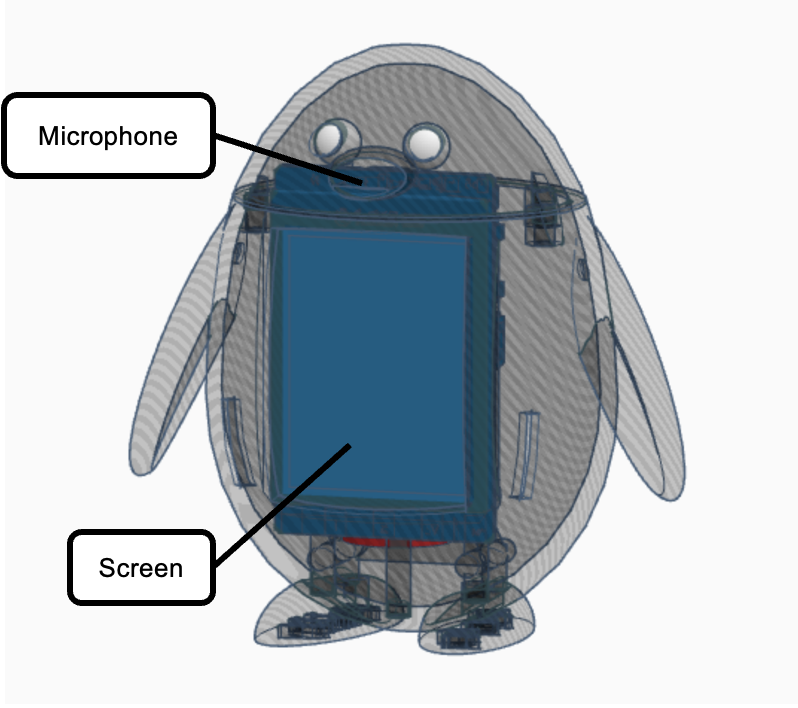

# Wally

*A bilingual voice-powered AI companion, built using XiaoZhi’s intelligent assistant platform.*

[English](README.md) | [中文](README_cn.md) | [日本語](README_ja.md)

## Overview

**Wally** is a warm, reliable voice assistant in the shape of a penguin. It is designed to help users with reminders, productivity, daily conversations, and emotional support, all of this in one portable ESP32-based device.

> [!NOTE]
> Wally is currently a prototype and not yet available for purchase, public use or distribution. Stay tuned for updates!

## Core Features

* **Voice Wake-Up**: Wake word: "Hi, Wally" or "Hi Wall-E" triggers Wally to start listening and responding

* **Bilingual Voice Chat**: Fluent interaction in both English and Mandarin

* **Real-Time Streaming Responses**: Instant replies from XiaoZhi-powered LLM backend (Qwen, Deepseek etc)

* **OLED/Display Feedback**: On-screen reply visualization with various emojis for interaction

## Demo

### 3D Design

### Internal Structure (Front + Back View)
 

### Wally In Use
 

### Demo Video
[Watch on Youtube](https://youtu.be/0H2t0p9YrDw) or download it (view raw) [here](demo/wally-vid.mp4).

## Technical Overview

* **Powered by**: [XiaoZhi](https://github.com/78/xiaozhi-esp32) cloud + ESP32 firmware

* **Board compatibility**: [DFRobot (UNIHiker)](https://www.dfrobot.com/)

* **Backend**: Uses XiaoZhi’s LLM (Qwen, Deepseek, etc) response system

* **Frontend**: Device firmware via XiaoZhi flashing tools and preset images

* **Wake Word Engine**: ESP-SR based offline recognition

* **Voice Synthesis**: TTS via Volcano Engine or CosyVoice

* **Outer Shell**: Designed in [Tinkercad](https://www.tinkercad.com/) and 3D printed via [Bambu Lab P1](https://bambulab.com/en-us/p1)

## Network Configuration (Setup)

1. **Turn on Wally**: Flip the switch on Wally’s back to power it on.

2. **Enter Configuration Mode**: Remove Wally’s head to access the internal board. On the back of the board, locate the round button next to the white battery stand. Press that button and the one labeled “B” at the same time. Wally will report: *“Entering network configuration mode.”*

3. **Connect to Wally’s Setup Network**: On your phone or laptop, connect to the Wi-Fi network named **`Xiaozhi`**. A configuration webpage should automatically open. If it doesn’t, open your browser and go to the address displayed on Wally’s screen.

4. **Enter Your Wi-Fi Details**: On the setup page, input your Wi-Fi network’s **name (SSID)** and **password**. (You can choose to remember this network for future use.)

5. **You're All Set!**: Once configuration is complete, follow the next set of instructions to start using Wally.
   

## Getting Started

> [!IMPORTANT]
> Only follow the below instructions once network configuration has been completed.

1. Say "Hi, Wally" to wake Wally up.
2. Start chatting with Wally.
3. Say any form of goodbye you like to shut Wally down.

## Acknowledgements

Special thanks to:
- [Xiao Xia](https://github.com/78) and his amazing project [XiaoZhi](https://github.com/78/xiaozhi-esp32)
- [The Xiao Zhi Platform](https://xiaozhi.me/)

## Contributions

Let's make Wally better! Feel free to open issues and pull requests.

## License

This project is licensed under the [MIT License](LICENSE).

---

### Made with 💙 by July. If you find this project cool or helpful, please give it a star!
